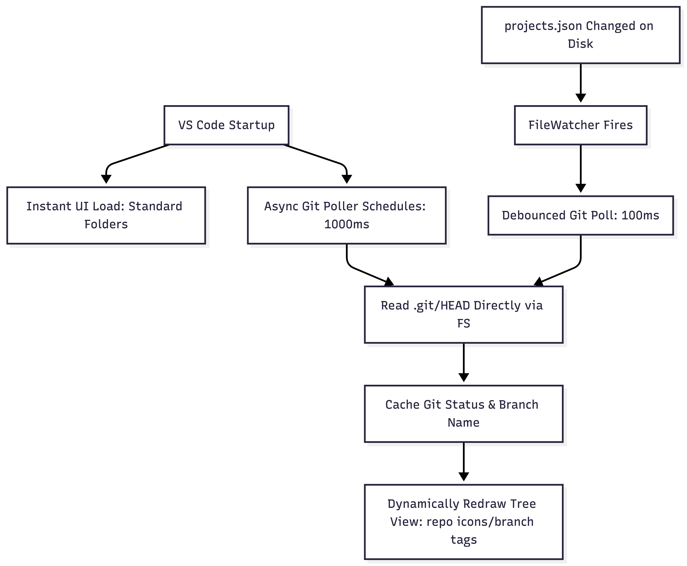

[](https://marketplace.visualstudio.com/items?itemName=marcosfrancodeveloper.project-organizer)
[](https://open-vsx.org/extension/marcosfrancodeveloper/project-organizer)
[](https://open-vsx.org/extension/marcosfrancodeveloper/project-organizer)
[](https://github.com/marcosfrancodeveloper/vscode-project-organizer/actions/workflows/main.yml)

<p align="center">
  <br />
  <a title="Learn more about Project Organizer" href="https://github.com/marcosfrancodeveloper/vscode-project-organizer"></a>
</p>

# Project Organizer

**Project Organizer** is a high-performance, developer-focused VS Code extension designed to help you organize and switch between multiple local projects and workspaces effortlessly. No matter where your repositories are scattered on your disk, Project Organizer brings them together in a clean, customizable hierarchy.

---

## Key Features

*   **Collapsible Custom Groups:** Group your projects into unlimited hierarchical directories (e.g., `Work/Client-A/Frontend` or `Personal/Sandbox`).
*   **Lazy-Loaded Git Monitoring:** Asynchronously retrieves branch names and dirty states in the background without slowing down the initial VS Code UI rendering.
*   **Advanced Quick Open Palette:** Instantly search through projects by combining names, file paths, tags, or markdown notes with fuzzy filtering.
*   **Flat Favorites View:** Pin your most frequently accessed projects in a separate flat list for immediate access.
*   **Import Utilities:** Migrate your existing project configuration files from legacy extensions like *Project Manager* with a single click (in merge or replace mode).
*   **Flexible Storage Sync:** Keep your settings synchronized across machines by pointing the database to an external JSON file (e.g. Dropbox, Google Drive, or dotfiles repositories).

---

## How It Works (Performance Architecture)

Project Organizer was built from the ground up to respect developer workspaces. It incorporates optimized algorithms to prevent IDE slowdowns, even when managing hundreds of repositories:

<p align="center">
  
</p>

### 1. Direct HEAD File Parsing (Zero Spawn Overhead)
Traditional Git monitoring extensions run child processes (`git status`, `git branch`) for every single repository. On Windows, spawning processes is extremely heavy and easily causes CPU bottlenecks. 
*   **Our Solution:** Project Organizer reads and parses the `.git/HEAD` file directly using Node.js filesystem APIs. It only spawns a Git process when verifying dirty state modifications or unpushed commits count. This makes active branch detection nearly instantaneous and consumes virtually zero CPU.
*   **Worktree & Submodule Support:** If a project uses Git worktrees or submodules where `.git` is a file instead of a folder, the extension parses the `gitdir:` path pointer to resolve the real HEAD file.

### 2. Asynchronous Lazy Loading
When VS Code loads the sidebar, Project Organizer renders your directories instantly with default icons and no descriptions. The background poller then processes project statuses **sequentially** (rather than concurrently via `Promise.all` which causes I/O spikes) and caches the results. The tree redraws lazily only when new Git states are resolved.

### 3. $O(N)$ Hierarchy Caching
To resolve parent folders and logical paths (e.g. for Vim keybindings, reveal actions, or sidebar selections), the tree provider constructs a single in-memory graph map on-demand during updates. This eliminates nested depth-first searches, reducing lookup operations from $O(N^2 \cdot \text{I/O})$ down to $O(N)$ with exactly one database read.

---

## Database Schema & Persistence Model

You can edit your projects database JSON file directly in VS Code by running `Project Organizer: Edit Projects File`. The extension saves your hierarchy in a single-level nested structure. 

An example of the data schema:

```json
{
  "Corporate": {
    "Web Portal": {
      "id": "L1VzZXJzL21hcmNvc2ZyYW5jby9Eb2N1bWVudHMvcHJvamVjdHMvd2ViLXBvcnRhbA",
      "path": "/paths/corporate/web-portal",
      "notes": "### Backend Connection\nUse port `8080` for local development.",
      "tags": ["frontend", "react", "typescript"],
      "lastAccessed": 1780433838000,
      "favorite": true,
      "position": 1
    },
    "$position": 1
  },
  "Sandbox": {
    "Test Repo": {
      "id": "L1VzZXJzL21hcmNvc2ZyYW5jby9Eb2N1bWVudHMvcHJvamVjdHMvdGVzdC1yZXBv",
      "path": "/paths/sandbox/test-repo",
      "lastAccessed": 1780427953000,
      "deprecated": true
    }
  }
}
```
*   `$position`: Stores the custom sorting order of a group.
*   `deprecated`: Projects marked as archived/deprecated can be toggled visible or invisible via settings.

---

## Available Commands

| Command | Description | Shortcut (Menus) |
| :--- | :--- | :--- |
| `Project Organizer: Add Project` | Save the currently open editor folder as a project. | Context Menu / Palette |
| `Project Organizer: Add Project Folder` | Pick any folder on disk to add to the hierarchy. | Sidebar Header |
| `Project Organizer: Search Projects` | Open the Quick Open search palette. | Header / `Ctrl+Alt+P` |
| `Project Organizer: Scan Folders...` | Scan local paths for Git repositories recursively. | Secondary Title Menu |
| `Project Organizer: Edit Projects File` | Edit the physical JSON database directly. | Sidebar / Context Menu |
| `Project Organizer: Expand All Groups` | Recursively expand all groups in the tree view. | Sidebar Title Bar |
| `Project Organizer: Collapse All Groups` | Recursively collapse all groups in the tree view. | Sidebar Title Bar |
| `Project Organizer: Favorite` / `Unfavorite` | Pin or unpin a project to/from the Favorites list. | Inline Button / Menu |
| `Project Organizer: Set Position...` | Set custom display index for drag-and-drop order. | Context Menu |

---

## Configuration Settings

Configure these options in VS Code Settings (`Ctrl+,` or `Cmd+,` on macOS):

### `projectOrganizer.scanPaths`
An array of directories to scan for Git repositories. Supports the home directory shorthand `~/`.
```json
"projectOrganizer.scanPaths": ["~/projects/work", "~/projects/sandbox"]
```

### `projectOrganizer.scanDepth`
How deep the automatic scanner crawls directory paths to search for repositories (default is `3`).
```json
"projectOrganizer.scanDepth": 3
```

### `projectOrganizer.ignoredFolders`
Excludes specific directories from crawling to save disk overhead and boost scanning performance.
```json
"projectOrganizer.ignoredFolders": ["node_modules", "dist", "bin", ".git", "vendor"]
```

### `projectOrganizer.gitStatusEnabled`
Enables background Git checks (branch detection, modified files, unpushed commits) (default is `true`).
```json
"projectOrganizer.gitStatusEnabled": true
```

### `projectOrganizer.gitStatusInterval`
Configures the delay in milliseconds between background updates. Since the poller runs sequentially and recursively, this delay starts only **after** the current cycle completes, eliminating process accumulation (default is `15000` ms).
```json
"projectOrganizer.gitStatusInterval": 15000
```

### `projectOrganizer.customProjectsFile`
Path to a custom JSON file to store your project tree. Useful to sync your projects across machines.
```json
"projectOrganizer.customProjectsFile": "~/Sync/vscode-projects.json"
```

### `projectOrganizer.sortBy`
Selects the sorting criteria for projects inside groups: `"name"` (alphabetical) or `"lastAccessed"` (LRU).
```json
"projectOrganizer.sortBy": "name"
```

---

## Keyboard Focused Users (Vim Style)

If you use keyboard-driven shortcuts, you can bind keys to navigate the Quick Open list using the `inProjectOrganizerList` context clause:

```json
[
  {
    "key": "cmd+j",
    "command": "workbench.action.quickOpenSelectNext",
    "when": "inProjectOrganizerList && isMac"
  },
  {
    "key": "cmd+shift+j",
    "command": "workbench.action.quickOpenSelectPrevious",
    "when": "inProjectOrganizerList && isMac"
  },
  {
    "key": "ctrl+j",
    "command": "workbench.action.quickOpenSelectNext",
    "when": "inProjectOrganizerList && (isWindows || isLinux)"
  }
]
```

---

## License

This project is licensed under the [GNU General Public License v3](LICENSE.md).
